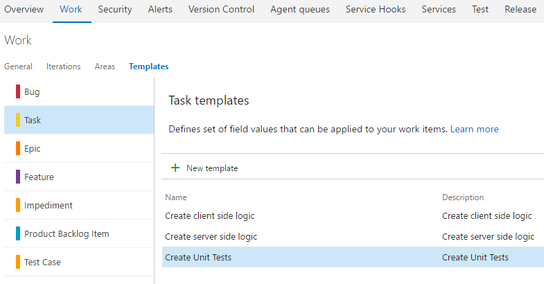
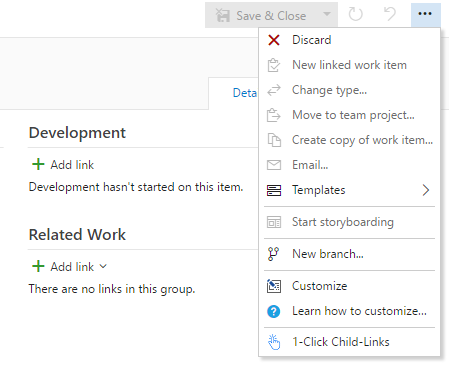
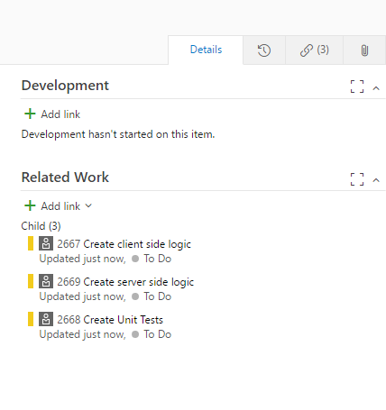

## 1-Click Child-Links ##

<a href="https://marketplace.visualstudio.com/items?itemName=ruifig.vsts-work-item-one-click-child-links" target="_blank">1-Click Child-Links</a> is an Azure DevOps extension for creating multiple work items as children via single click, where each work item is based on a single pre-defined template.

Azure DevOps offers team-specific work item templating as <a href="https://docs.microsoft.com/en-us/azure/devops/boards/backlogs/work-item-template?view=azure-devops&tabs=browser" target="_blank">core functionality</a> with which you can quickly apply pre-populated values for your team's commonly used fields per work item type.

The child work items created by this extension are based on the hierarchy of work item types defined in the process template (<a href="https://docs.microsoft.com/en-us/azure/devops/boards/work-items/guidance/agile-process-workflow?view=azure-devops" target="_blank">Agile</a>, <a href="https://docs.microsoft.com/en-us/azure/devops/boards/work-items/guidance/scrum-process-workflow?view=azure-devops" target="_blank">Scrum</a>, <a href="https://docs.microsoft.com/en-us/azure/devops/boards/work-items/guidance/cmmi-process-workflow?view=azure-devops" target="_blank">CMMI</a>).

For example, if you're using a process inherited from the agile template with a custom requirement-level type called defect and 3 task templates defined, using 1-click on a user story or defect will generate three child tasks, one for each defined template.

It's also possible to limit which parent work items apply to each template in one of two ways:

Simplified: put the list of applicable parent work item types in the child template's description field, like this: `[Product Backlog Item,Defect]`

Complex: put a minified (single line) JSON string into the child template's description field, like this:

``` json
{
    "applywhen": [
    {
        "System.State": "Approved",
        "System.Tags" : ["Blah", "ClickMe"],
        "System.WorkItemType": "Product Backlog Item"
    },
    {
        "System.BoardColumn": "Testing",
        "System.BoardLane": "Off radar",
        "System.State": "Custom State",
        "System.Title": "Repeatable item",
        "System.WorkItemType": "Custom Type"
    }]
}
```

### Define team templates ###

<a href="https://docs.microsoft.com/en-us/azure/devops/boards/backlogs/work-item-template?view=azure-devops&tabs=browser#manage" target="_blank">Manage work item templates</a>



### Create / open a work item ###

Find 1-Click Child-Links on toolbar menu



### Done ###

You should now have children associated with the open work item.



## Release notes ##

* v0.10.0
  * Template applicability criteria can be defined using complex JSON objects in the template description.

* v0.8.0
  * Template sets can now be created on keywords in titles on top of Work Item Types
  * Inherit values from parent work item fields (<a href="https://github.com/figueiredorui/1-click-child-links/wiki/Inherit-field-values-from-parent-work-item" target="_blank">wiki</a>)
  * Copy field value from parent (<a href="https://github.com/figueiredorui/1-click-child-links/wiki/Copy-field-value-from-parent" target="_blank">wiki</a>)

* v0.6.0
  * 1-Click Child-Links option available when selecting multiple work items

* v0.5.0
  * 1-Click Child-Links option available on Card and Backlog context menu.

* v0.4.0
  * Identifier to distinguish templates sets to be added in a single click (<a href="https://github.com/figueiredorui/1-click-child-links/wiki/Group-templates-with-identifier" target="_blank">wiki</a>)

* v0.3.0
  * Enforce correct order when adding child links to work item

## Contributors ##

<a href="https://github.com/jdshkolnik"></a>
<a href="https://github.com/thesobercoder"></a>

## Learn more ##

This extension is an enhanced version of <a href="https://marketplace.visualstudio.com/items?itemName=ruifig.vsts-work-item-one-click-tasks" target="_blank">1-Click Tasks</a>

The <a href="https://github.com/figueiredorui/1-click-child-links" target="_blank">source</a> for this extension is on GitHub. Take, fork, and extend.

Let's discuss <a href="https://github.com/figueiredorui/1-click-child-links/issues" target="_blank">issues and improvements</a>.